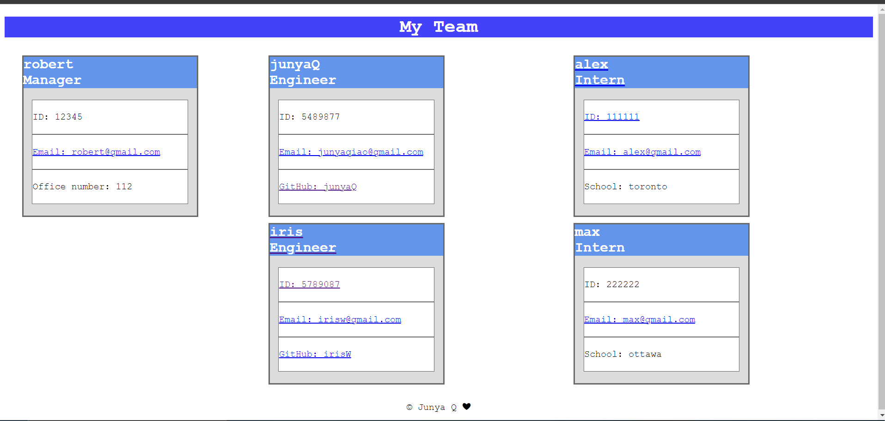

# Bootcamp_challenge-10_TeamProfileGenerator

## How to run the application
WHEN run the test code 
THEN use command: npm run test 
WHEN run the application 
THEN use command: node index.js 

## Information about the application:
This is a command line application that will generate a html page based on input 
WHEN start the application 
THEN questions will show on commandline 
FIRSR will ask for manager information, including: name, ID, email and office number 
THEN the application will check following:   
- make sure there is a name input(not blank)
- make sure the ID is a number
- make sure email address is an email format (have @)
- make sure office number is a number

AFTER finish manager input 
THEN will ask to choose between engineer or Intern or exit if finish all the members input 
WHEN choose engineer 
THEN the application will ask for engineer information, including: name, id, email and github name 
WHEN doing the command line input 
THEN the apllication will check following: <>br/
- make sure there is a name input (not blank)
- make sure the ID is a number
- make sure the emaill address is an email format (have @)
- make sure there is a github name input (not blank)

WHEN choose intern 
THEN the application will ask for intern information, including: name, ID, email, school name 
WHEN doing the command line input 
THEN the application will check the following:  
- make sure there is a name input(not blank)
- make sure the ID is a number
- make srue the email address is an email format (have @)
- make sure there is a school name input (not blank)

WHEN choose exit 
THEN the application will start to generate test_index.html 

## Test
The gif showing the result of the test and how to run the test 
 

## How to use the command line application 
The gif showing how to run the application and a sample of what type of input you should put for each question 
 
AFTER answer all the command line question, the html form is generated
 
